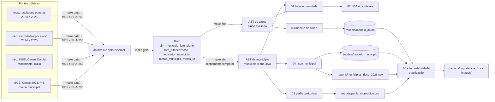
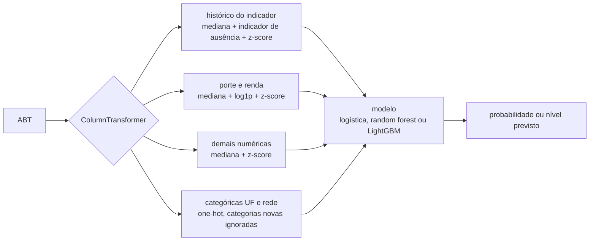

# Predição e Inteligência Analítica para Alfabetização no Brasil

Tech Challenge da Fase 3 do MBA em AI Scientist (FIAP / POSTECH). O projeto usa a camada Gold construída na Fase 2, sobre o Indicador Criança Alfabetizada, para treinar e avaliar modelos de Machine Learning com três finalidades: prever se um aluno do 2º ano será considerado alfabetizado, estimar o risco de cada município não atingir a meta do ano seguinte e agrupar municípios em perfis de contexto. Os modelos são explicados com SHAP e os resultados são organizados em listas e mapas para uso em política pública.

Aluno: Guilherme Cosme (RM 372204).

- Apresentação executiva: [reports/slides/RM372204 - Guilherme Cosme - Tech Challenge Fase 03.pdf](<reports/slides/RM372204 - Guilherme Cosme - Tech Challenge Fase 03.pdf>)
- Vídeo executivo (até 5 min): [reports/slides/link_do_video.txt](reports/slides/link_do_video.txt)
- Ranking de risco 2026: [reports/municipios_risco_2026.csv](reports/municipios_risco_2026.csv)
- Métricas consolidadas: [reports/metricas.md](reports/metricas.md)

## Sumário

1. [Contexto do problema](#1-contexto-do-problema)
2. [Objetivo analítico](#2-objetivo-analítico)
3. [Descrição da base utilizada](#3-descrição-da-base-utilizada)
4. [Pipeline do projeto](#4-pipeline-do-projeto)
5. [Análise exploratória](#5-análise-exploratória)
6. [Etapas de modelagem](#6-etapas-de-modelagem)
7. [Escolha do algoritmo](#7-escolha-do-algoritmo)
8. [Métricas de avaliação](#8-métricas-de-avaliação)
9. [Interpretação dos resultados](#9-interpretação-dos-resultados)
10. [Insights encontrados](#10-insights-encontrados)
11. [Limitações do projeto](#11-limitações-do-projeto)
12. [Aplicação prática para políticas públicas](#12-aplicação-prática-para-políticas-públicas)
13. [Possíveis evoluções futuras](#13-possíveis-evoluções-futuras)
14. [Estrutura do repositório](#14-estrutura-do-repositório)
15. [Como executar](#15-como-executar)
16. [Organização do trabalho e documentação técnica](#16-organização-do-trabalho-e-documentação-técnica)

## 1. Contexto do problema

O Compromisso Nacional Criança Alfabetizada estabelece que todas as crianças devem estar alfabetizadas ao final do 2º ano do ensino fundamental até 2030. Para acompanhar essa meta, o Inep definiu, com base na Pesquisa Alfabetiza Brasil (2023), o corte de 743 pontos na escala Saeb como o nível a partir do qual uma criança é considerada alfabetizada. Desde 2023 o Inep publica o Indicador Criança Alfabetizada por município (percentual de alunos da rede municipal que atingem o corte), com metas anuais pactuadas para cada município e UF até 2030.

Números do período coberto pelo projeto:

| | 2023 | 2024 | 2025 |
|---|---:|---:|---:|
| Indicador Brasil (rede pública) | 55,9% | 59,2% | 66,0% |
| Meta nacional | | 59,9% | 63,8% |
| Municípios com resultado publicado | 5.357 | 5.446 | 5.485 |
| Municípios que atingiram a meta | | 53% | 72% |
| Alunos avaliados (microdados) | | 1,85 milhão | 1,97 milhão |

A dispersão entre municípios é grande: em 2025 os percentuais vão de menos de 20% a 100%, e a diferença entre UFs chega a 36 pontos percentuais (Ceará 84%, Rio Grande do Norte 48%). O indicador informa a situação de cada município depois da prova. A necessidade da gestão é anterior: identificar, antes do resultado, os municípios que tendem a não atingir a meta, entender quais fatores estão associados ao resultado e agrupar municípios com condições parecidas para desenhar intervenções.

## 2. Objetivo analítico

Construir uma pipeline completa de Machine Learning, do dado bruto ao modelo interpretado, que responda às perguntas do desafio:

| Pergunta do enunciado | Entrega | Onde está |
|---|---|---|
| Prever se um aluno será alfabetizado | classificador no grão de aluno, com pesos amostrais e teste temporal | notebook 03, `models/modelo_aluno.joblib` |
| Quais municípios apresentam maior risco educacional | risco de não atingir a meta, derivado da regressão do nível do indicador; ranking e mapa | notebook 04, `reports/municipios_risco_2026.csv` |
| Quais regiões possuem padrões semelhantes | quatro perfis de município (K-Means, hierárquico, PCA), cruzados com o risco | notebook 05, `reports/perfis_municipios.csv` |
| Como prever municípios que podem não atingir metas futuras | backtest 2024 para 2025 e projeção para 2026 | notebook 04, `reports/risco_2026_por_uf.csv` |
| Quais fatores e variáveis mais influenciam | SHAP global, por bloco e local; importância por permutação; seleção de features (Lasso e RFE) | notebooks 04 e 06, `reports/importancia_*.csv` |

## 3. Descrição da base utilizada

### 3.1 Da Gold da Fase 2 ao dado real

A Fase 2 entregou a camada Gold com o contrato de esquema (dimensão de município, fato no grão ano x município x rede, marts de indicador, evolução temporal e comparação por UF). Naquela fase o indicador e as metas foram simulados, porque o microdado do indicador só estava disponível pela Base dos Dados via BigQuery com projeto de billing. O Inep passou a publicar diretamente as planilhas de resultados e metas por município (2023, 2024 e 2025) e, em agosto de 2025, os microdados da avaliação no grão de aluno (2024 e 2025). Nesta fase a Gold foi recomposta no mesmo contrato com essas fontes e ganhou a tabela `fato_aluno`. A mesma substituição foi aplicada ao repositório da Fase 2 (PR 23), que passou a gerar seus seeds a partir das fontes do Inep.

| Tabela da Gold | Grão | Linhas | Origem |
|---|---|---:|---|
| `dim_municipio` | município | 5.570 | planilhas do Inep e microdados |
| `fato_aluno` | aluno listado para a prova, presente ou não | 4.343.352 | microdados 2024 e 2025 |
| `fato_alfabetizacao` | ano x município x rede | 13.110 | agregado dos microdados, reproduzindo o cálculo oficial |
| `indicador_municipio` | ano x município (rede municipal) | 16.528 | planilhas de divulgação (2023) e microdados (2024 e 2025) |
| `metas_municipio` | município x ano da meta (2024 a 2030) | 38.656 | planilhas de divulgação |
| `metas_uf` | UF x ano da meta | 194 | planilhas de divulgação |
| `evolucao_temporal`, `comparacao_meta_uf` | marts derivados | 16.528 e 136 | derivados |

Regras aplicadas na montagem da Gold, verificadas no notebook 01:

- o percentual municipal é a média ponderada pelo peso amostral entre presentes com prova preenchida, que é o cálculo oficial; sem a ponderação, a diferença para o número publicado é de 0,35 ponto percentual; com ela, 0,03;
- alunos ausentes ficam registrados em `fato_aluno` com `alfabetizado = 0`, mas fora do denominador do indicador, como faz o Inep;
- a planilha de 2025 publica percentuais e metas arredondados para inteiros; nos anos com microdados o percentual vem do agregado exato, e a trajetória de metas de cada município vem inteira de uma única planilha, com a precisão das anteriores quando coincidem após o arredondamento;
- dois municípios têm meta 2030 igual a zero na planilha de 2025 (erro de preenchimento); meta zero é tratada como ausente.

### 3.2 Fontes de enriquecimento

Todas públicas, sem credencial, baixadas por `make data` e conferidas por MD5 (zips do Inep) ou SHA-256 (`data/manifest.json`).

| Fonte | Conteúdo | Grão | Anos |
|---|---|---|---|
| Inep, INSE | nível socioeconômico médio dos alunos, distribuição por nível, fatia de alunos em escolas rurais | município | 2023 |
| Inep, Censo Escolar | adequação da formação docente, alunos por turma, distorção idade-série, docentes com curso superior | município x rede x localização | 2024, 2025 |
| Inep, rendimento escolar | aprovação, reprovação e abandono por ano escolar | município x rede x localização | 2023, 2024 |
| Inep, IDEB | IDEB, nota Saeb e fluxo dos anos iniciais | município x rede | 2005 a 2025 (bienal) |
| IBGE, Censo 2022 (SIDRA 4714) | população, área, densidade | município | 2022 |
| IBGE, PIB dos municípios (SIDRA 5938) | PIB e participação dos setores no valor adicionado | município | 2021 |
| IBGE, malha municipal | GeoJSON em qualidade mínima, para os mapas | município | 2022 |

FUNDEB, Cadastro Único, Atlas do Desenvolvimento Humano e PNAD foram avaliados e não entraram (sem download direto estável por município, dado defasado ou sem representatividade municipal). Detalhes em [docs/fontes_de_dados.md](docs/fontes_de_dados.md).

### 3.3 Bases analíticas e alinhamento temporal

Duas bases saem da Gold (`make abt`):

- **ABT de município** (`data/processed/abt_municipio.parquet`): uma linha por município e ano-alvo (2024 e 2025 com alvo; 2026 para projeção), 56 colunas;
- **ABT de aluno** (`data/processed/abt_aluno.parquet`): uma linha por aluno avaliado (3.817.947), com rede, escola (alunos avaliados e presença) e as chaves para juntar o contexto municipal do mesmo ano.

Para o ano-alvo t (prova aplicada em outubro e novembro), só entram variáveis conhecidas antes da prova:

| Bloco | Regra | 2024 | 2025 | 2026 (projeção) |
|---|---|---|---|---|
| Censo Escolar (docentes, turmas, distorção) | edição de t (referência em maio) | 2024 | 2025 | 2025 (última disponível) |
| Rendimento escolar | edição de t-1 | 2023 | 2024 | 2024 (última disponível) |
| IDEB | última edição até t-1 | 2023 | 2023 | 2025 |
| Indicador | t-1 | 2023 | 2024 | 2025 |
| Meta | t | 2024 | 2025 | 2026 |
| Censo 2022, PIB 2021, INSE 2023 | estáticos | | | |

A regra está em `src/data/abt.py` e é verificada em `tests/test_abt.py`. Dicionário completo em [docs/dicionario_de_dados.md](docs/dicionario_de_dados.md).

## 4. Pipeline do projeto

### 4.1 Fluxo de dados



### 4.2 Pipeline de preprocessamento e modelo

Um único `Pipeline` do scikit-learn, com um `ColumnTransformer` de quatro ramos e o modelo no fim. O objeto inteiro é ajustado dentro de cada fold da validação e é o que fica persistido em `models/`.



| Requisito do enunciado | Como foi atendido |
|---|---|
| Imputação de valores faltantes para numéricas | `SimpleImputer(strategy="median")` em todos os ramos numéricos, ajustado no treino; indicador de ausência no bloco do histórico, porque município sem resultado no ano anterior é informativo |
| Transformação de numéricas e categóricas | log1p nas variáveis de porte e renda (assimetria acima de 6), padronização z-score, one-hot para UF e rede |
| Tratamento de data leakage | alinhamento temporal testado; validação por grupos de município; teste em 2025 aberto uma vez; nada ajustado antes do split |
| Preprocessamento integrado ao modelo | o `Pipeline` completo é o objeto validado, persistido e reutilizado nos notebooks 04 e 06 |
| Treinamento e validação | busca aleatória de hiperparâmetros com validação cruzada por grupos; métricas de treino e validação lado a lado |
| Replicabilidade e generalização | `random_state=42` em todo passo estocástico; curva de aprendizado; backtest temporal 2024 para 2025 |

## 5. Análise exploratória

O notebook 02 testa catorze hipóteses e registra, para cada uma, a decisão de modelagem que ela sustenta. Resumo:

| Hipótese | Teste | Resultado | Decisão |
|---|---|---|---|
| H1. A UF explica grande parte da variação do indicador entre municípios | Kruskal-Wallis e eta quadrado | eta² = 0,35 para UF; 0,06 para região | UF entra como categórica; região fica de fora; validação separa municípios, não UFs |
| H2 a H4. INSE, ruralidade e PIB per capita se associam ao indicador | Spearman | INSE 0,09; PIB per capita 0,04; população (log) -0,28; alunos em escola rural -0,16 | entram como numéricas; log nas variáveis de porte e renda; expectativa de peso baixo |
| H5 a H8. Condições de ensino | Spearman | abandono -0,39; reprovação -0,36; distorção idade-série -0,35; docentes com superior 0,19; alunos por turma -0,12 | entram como numéricas; relações não lineares pedem árvores além da logística |
| H9 e H10. O resultado anterior e o IDEB preveem o indicador | Spearman | indicador do ano anterior 0,69; IDEB 0,49 | histórico entra; ablação obrigatória |
| H11. A chance de atingir a meta cai com o salto necessário | taxa de atingimento por faixa | monotônica em 2025; em 2024 as metas foram fixadas perto do resultado de 2023 e a relação não existe | teste temporal obrigatório; saída em probabilidade |
| H12 a H14. Grão de aluno | qui-quadrado e decomposição de variância | rede: diferença pequena que muda de sinal entre anos; 85% da variância do alvo está entre alunos da mesma escola | métricas ponderadas; AUC como métrica principal; teto do modelo documentado |

Outros achados da EDA: correlações altas entre nível e indicador do ano anterior (0,98), IDEB e nota de português (0,97), reprovação e distorção (0,84) e INSE e PIB per capita (0,75), tratadas com regularização L2 na logística e leitura conjunta no SHAP; assimetria acima de 6 em densidade e PIB per capita; nulos concentrados no histórico (municípios sem resultado no ano anterior) e no IDEB. A tabela completa está no notebook 02 e em [docs/decisoes_analiticas.md](docs/decisoes_analiticas.md).

## 6. Etapas de modelagem

| Etapa | Notebook | Conteúdo |
|---|---|---|
| 1. Base e qualidade | [01_base_gold_e_qualidade](notebooks/01_base_gold_e_qualidade.ipynb) | tabelas da Gold, cobertura por ano, doze checagens de qualidade (chaves, faixas, corte de 743, metas não decrescentes, cálculo próprio contra o oficial), ABTs e referências temporais |
| 2. EDA e hipóteses | [02_eda_e_hipoteses](notebooks/02_eda_e_hipoteses.ipynb) | catorze hipóteses testadas e a tabela de decisões |
| 3. Modelo do aluno | [03_modelo_aluno](notebooks/03_modelo_aluno.ipynb) | busca de hiperparâmetros em amostra estratificada de 300 mil alunos, ablação por bloco, curva de aprendizado, ajuste final em 1,85 milhão de alunos, limiar de operação, teste em 2025, análise de erros |
| 4. Risco municipal | [04_modelo_municipio_risco](notebooks/04_modelo_municipio_risco.ipynb) | classificador direto e regressão do nível com risco derivado, backtest 2024 para 2025, projeção 2026 e ranking |
| 5. Perfis territoriais | [05_perfis_territoriais](notebooks/05_perfis_territoriais.ipynb) | K-Means com cotovelo, silhueta e Davies-Bouldin, hierárquico de Ward, PCA, perfis e matriz perfil x risco |
| 6. Interpretabilidade | [06_interpretabilidade_e_aplicacao](notebooks/06_interpretabilidade_e_aplicacao.ipynb) | SHAP global, por bloco, dependência e local; permutação; mapas; respostas às cinco perguntas |

### 6.1 Modelo do aluno

- Alvo: `alfabetizado` (proficiência >= 743). Universo: presentes com prova preenchida.
- Treino: 2024 (1.851.852 alunos, 5.517 municípios), com pesos amostrais. Teste: 2025 (1.966.095 alunos).
- Variáveis (42): rede, UF, alunos avaliados e presença na prova na escola, histórico do indicador do município, Censo Escolar, rendimento, IDEB, socioeconômico, porte e renda.
- Validação: `StratifiedGroupKFold` por município (3 folds na busca, 3 folds na base inteira para as probabilidades fora da amostra).
- Ponto de operação: limiar de 0,63 sobre a probabilidade de ser alfabetizado, escolhido para recall mínimo de 70% da classe "não alfabetizado" nas probabilidades fora da amostra de 2024.
- Duas variantes: a **completa**, que inclui presença na prova e alunos avaliados na escola (medidas no dia da prova; servem para ler o resultado depois da aplicação), e a **antes da prova**, sem essas duas variáveis, para triagem antes do ano letivo. Não é vazamento do alvo; é uma questão de quando a variável existe.

### 6.2 Modelo de risco municipal

- Alvo operacional: não atingir a meta do ano. Alvo modelado: o nível do indicador (percentual de alfabetizados da rede municipal).
- Risco derivado: `P(nível real < meta) = P(resíduo < meta - nível previsto)`, com a distribuição empírica dos resíduos da validação por grupos.
- Treino e validação em 2024 (5.425 municípios), teste em 2025 (5.439). Projeção 2026 (5.477 municípios com meta) com o modelo reajustado nas linhas de 2025.
- Ponto de operação: limiar de 0,53 sobre a probabilidade de atingir, para recall mínimo de 70% da classe "não atingiu".
- Seleção de features: Lasso (embedded) e RFE com LightGBM (wrapper) sobre o espaço transformado, com cada subconjunto reavaliado na validação por grupos e no backtest.
- Incerteza entre anos: na projeção de 2026, o risco usa os resíduos da validação de 2025 somados a um efeito ano uniforme de +/- 7,3 p.p. (o viés medido no backtest), porque os resíduos de um único ano não contêm o deslocamento que um ano inteiro pode ter.

### 6.3 Perfis territoriais

Quinze variáveis de contexto (histórico, fluxo escolar, docentes, IDEB, INSE, ruralidade, porte, renda, agropecuária), imputadas e padronizadas. K-Means com K = 4, escolhido por cotovelo, silhueta e Davies-Bouldin; contraste com o hierárquico de Ward; PCA para interpretação.

## 7. Escolha do algoritmo

Três famílias foram comparadas em cada problema, com o mesmo pipeline e busca aleatória de hiperparâmetros (`RandomizedSearchCV`): regressão logística com L2, Random Forest e LightGBM (gradient boosting). Para o nível do indicador, Ridge, Random Forest e LightGBM.

**Modelo do aluno.** LightGBM, com AUC de validação 0,667, contra 0,664 da logística e 0,665 da Random Forest. A diferença é pequena porque a maior parte do sinal disponível é linear no contexto. O gap entre treino e validação é de 0,004 na logística e 0,026 nas árvores.

**Modelo de município.** A decisão relevante foi entre formulações, não entre famílias. O classificador direto de "atingiu a meta" chega a AUC 0,81 na validação de 2024 e cai no teste de 2025 para 0,60 (LightGBM), 0,63 (Random Forest) e 0,75 (logística). A causa é a mudança na regra das metas: em 2024 as metas foram fixadas perto do resultado de 2023, e atingir a meta equivalia a não cair; em 2025 as metas exigem saltos crescentes. A verificação direta confirma: o salto necessário tem AUC 0,49 em 2024 e 0,74 em 2025 como preditor isolado. A regressão do nível, com a meta aplicada depois, mantém o AUC do risco em 0,77 no teste de 2025 e é a formulação entregue (LightGBM; Ridge e Random Forest ficam em 0,76).

**Perfis.** K-Means com K = 4. Entre K = 3 e K = 5 a silhueta e o Davies-Bouldin praticamente empatam; quatro grupos dão perfis interpretáveis e grandes o bastante para orientar política. Três dos quatro grupos são estáveis no hierárquico de Ward (Rand ajustado 0,50).

## 8. Métricas de avaliação

Todas as métricas são reportadas para treino e validação (para ler overfitting) e para o teste temporal (para ler generalização no tempo). Métricas do modelo do aluno ponderadas pelo peso amostral do Inep. Tabela completa em [reports/metricas.md](reports/metricas.md).

### 8.1 Modelo do aluno

| Conjunto | AUC-ROC | AUC-PR | Acurácia | Precisão | Recall | F1 | Precisão não alfab. | Recall não alfab. | Limiar |
|---|---:|---:|---:|---:|---:|---:|---:|---:|---:|
| validação 2024, limiar 0,5 | 0,663 | 0,738 | 0,635 | 0,657 | 0,803 | 0,723 | 0,578 | 0,391 | 0,50 |
| validação 2024, limiar de operação | 0,663 | 0,738 | 0,594 | 0,724 | 0,508 | 0,597 | 0,502 | 0,718 | 0,63 |
| teste 2025, limiar 0,5 | 0,646 | 0,776 | 0,651 | 0,704 | 0,809 | 0,753 | 0,490 | 0,350 | 0,50 |
| teste 2025, limiar de operação | 0,646 | 0,776 | 0,577 | 0,761 | 0,518 | 0,617 | 0,428 | 0,689 | 0,63 |

Ablação por bloco de variáveis (AUC de validação): só rede, UF, tamanho e presença da escola 0,642; contexto municipal sem histórico 0,659; só histórico e UF 0,649; completo 0,664. Variante antes da prova (sem presença e alunos avaliados na escola), no teste de 2025: AUC 0,641 e AUC-PR 0,772, contra 0,646 e 0,776 da completa; recall de não alfabetizados no mesmo limiar 0,668 contra 0,689 (`reports/modelo_aluno_variantes.csv`). A curva de aprendizado (10 mil a 200 mil alunos) mostra o AUC de validação subindo de 0,650 para 0,667 e o de treino caindo de 0,819 para 0,692; as curvas convergem antes do fim, o que indica que o limite é das variáveis disponíveis, não da quantidade de dados.

### 8.2 Modelo de município

| Métrica | Validação 2024 | Teste 2025 |
|---|---:|---:|
| MAE do nível (p.p.) | 8,5 | 11,4 |
| R² do nível | 0,65 | 0,11 |
| Viés do nível (previsto menos real, p.p.) | | -7,3 |
| Spearman do nível | | 0,69 |
| AUC do risco derivado | 0,80 | 0,77 |
| AUC do classificador direto (LightGBM) | 0,81 | 0,60 |
| AUC da regra simples (salto necessário) | 0,49 | 0,74 |
| Recall de "não atingiu" no ponto de operação | 0,70 | 0,81 |
| Precisão de "não atingiu" no ponto de operação | 0,71 | 0,44 |

Seleção de features (LightGBM reavaliado em cada subconjunto): todas as 66 colunas, MAE de validação 8,48 e AUC do risco 0,798 na validação e 0,772 no teste; Lasso com alpha 0,03 (47 colunas), 8,44, 0,799 e 0,772; RFE com 15 colunas, 9,87, 0,734 e 0,762. O modelo tolera remover cerca de vinte colunas redundantes sem perda; o corte para 15 custa 1,4 p.p. de MAE. O modelo entregue é o completo.

Projeção 2026: 936 municípios com risco acima de 50% (914 sem o efeito ano); o efeito ano reduz de 127 para 107 os municípios com risco acima de 90%.

O R² do nível em 2025 (0,11) mede o quanto o modelo explica da variação de um ano que incluiu um deslocamento nacional; as métricas de ordenação, que são as relevantes para a lista de risco, são o Spearman e o AUC do risco. O viés de -7,3 p.p. em 2025 corresponde ao aumento nacional do indicador naquele ano, concentrado em alguns estados (Bahia, Acre, Alagoas e Tocantins subiram mais de 15 pontos). O modelo treinado em 2024 subestima o nível de 2025, mas preserva a ordem dos municípios (Spearman 0,69). No ponto de operação, o modelo de 2024 aplicado a 2025 classifica mais municípios como em risco do que o necessário (recall dos negativos sobe para 0,81 e a precisão cai para 0,44), o erro menos custoso para uma lista de triagem.

### 8.3 Perfis

Silhueta 0,136 e Davies-Bouldin 1,937 para K = 4; a silhueta é baixa em todos os K testados (2 a 10), o que é esperado em dados socioeducacionais, que formam um contínuo. Rand ajustado de 0,50 entre K-Means e Ward.

## 9. Interpretação dos resultados

SHAP (TreeExplainer sobre o pipeline completo, no espaço transformado, com rótulos de negócio) e importância por permutação. Figuras em `images/06_*`, tabelas em `reports/importancia_*.csv`.

### 9.1 Modelo de município (nível previsto para 2026, em pontos percentuais)

| Variável | Importância SHAP média | Aumento do erro por permutação (p.p.) |
|---|---:|---:|
| % alfabetizados no ano anterior | 6,44 | 4,72 |
| IDEB anos iniciais (última edição) | 1,72 | 0,62 |
| UF (soma das dummies) | 3,5 | 1,14 |
| Participação na prova no ano anterior | 0,95 | 0,40 |
| Salto necessário para a meta | 0,88 | 0,21 |
| População (Censo 2022) | 0,68 | 0,19 |
| Nota de português no Saeb 5º ano | 0,68 | 0,22 |
| IDEB anos iniciais (edição anterior) | 0,67 | 0,10 |
| Taxa de abandono, anos iniciais | 0,63 | 0,07 |

Por bloco: histórico do indicador 38%, Censo Escolar, rendimento, IDEB e socioeconômico 34%, UF e rede 21%, porte e renda 8%.

As curvas de dependência mostram o formato de cada efeito. O IDEB tem efeito monotônico, de -4 a +3 pontos no nível previsto, com saturação nos extremos. O abandono funciona como um degrau: abandono zero nos anos iniciais vale meio ponto a mais; qualquer abandono custa cerca de um ponto. Distorção idade-série e INSE, que na EDA têm correlação clara com o resultado, pesam pouco dentro do modelo (menos de um ponto), porque o histórico e o IDEB já carregam essa informação.

### 9.2 Modelo do aluno (log-odds de ser alfabetizado)

Ordem de importância: % alfabetizados do município no ano anterior (0,196), salto necessário para a meta (0,141), presença na prova na escola (0,116), IDEB (0,102), nota de português (0,068), UF (RS, MG, BA, SP e CE entre as maiores), rede de ensino, participação na prova no ano anterior, alunos avaliados na escola e distorção idade-série. Por bloco: contexto (Censo Escolar, rendimento, IDEB, socioeconômico e escola) 40%, histórico 31%, UF e rede 25%, porte 4%.

### 9.3 Explicações locais

O notebook 06 traz gráficos em cascata para um município no topo da lista de risco de 2026 e para um município consolidado, mostrando como cada variável desloca a previsão a partir da média nacional. É o material que acompanha a lista de risco na conversa com o gestor.

## 10. Insights encontrados

1. **A UF explica um terço da variação do indicador entre municípios; a região, 6%.** Ceará e Bahia são vizinhos e estão em extremos opostos. Regime de colaboração estadual e instrumento de avaliação pesam mais do que geografia.
2. **Fluxo escolar tem correlação três vezes maior com o resultado do que renda.** Abandono, reprovação e distorção idade-série nos anos iniciais (-0,35 a -0,39) contra INSE (0,09) e PIB per capita (0,04). Dentro do modelo, o histórico e o IDEB absorvem a maior parte desse sinal.
3. **Municípios menores têm indicador maior** (Spearman -0,28 com a população).
4. **85% da variação entre alunos está dentro da escola.** Sem variáveis individuais, qualquer modelo tem esse teto; o uso do modelo do aluno é ordenar escolas e redes.
5. **Alvo binário dependente de regra administrativa não generaliza entre anos.** O classificador direto aprendeu a regra de 2024 e falhou em 2025; a regressão do nível com a meta aplicada depois é a formulação que se mantém.
6. **2025 foi um ano de salto** (6,8 pontos no indicador nacional; 9 na média municipal), com regressão à média em relação a 2024 (correlação de -0,41 entre a variação de 2024 e a de 2025). Modelos treinados em um ano subestimam o seguinte; o reajuste anual faz parte do método.
7. **O Rio Grande do Sul lidera o risco de 2026 por causa das metas, não das redes.** As metas foram ancoradas no nível de 2023 (73% em média); o estado caiu para 52% em 2024 (enchentes) e voltou a 64% em 2025; a meta de 2026 (74%) exige superar o nível anterior ao choque. 70% dos municípios gaúchos ficam com risco acima de 50%.
8. **Os perfis cortam as regiões.** O perfil de fluxo comprometido (838 municípios, 54% de alfabetizados) tem municípios em todas as regiões; o perfil de pequenos de baixa renda com resultado alto (1.386 municípios, 76%) é 82% nordestino, com INSE igual ao do perfil de fluxo comprometido.
9. **Presença na prova é um sinal forte no nível da escola.** De escolas com presença abaixo de 80% para escolas com presença quase total, a proporção de alfabetizados sobe de 52% para 72%.

## 11. Limitações do projeto

- **Sem variáveis do aluno.** Os microdados não trazem sexo, idade, nível socioeconômico individual nem trajetória escolar. O modelo do aluno é um modelo de contexto, e o AUC de 0,65 reflete esse teto.
- **Variáveis medidas no dia da prova.** Presença e alunos avaliados na escola só existem na aplicação; o modelo completo lê o resultado depois da prova e a variante sem elas é a que serve à triagem antecipada (AUC 0,641 contra 0,646).
- **Comparabilidade entre UFs.** Cada estado aplica a própria avaliação, pareada à escala Saeb. Parte do efeito da UF pode ser do instrumento, e o modelo não separa isso da gestão.
- **Série curta.** Três anos do indicador impedem modelos de série temporal e deixam as variáveis de defasagem dupla fora do modelo principal (só existem a partir de 2025).
- **Choques não previstos.** O aumento nacional de 2025 e a queda do Rio Grande do Sul em 2024 não eram previsíveis a partir do contexto. O modelo projeta a trajetória dado o contexto; não antecipa programas novos nem eventos externos. O efeito ano de +/- 7 p.p. na projeção representa essa incerteza, mas é uma estimativa a partir de uma única transição observada.
- **Fontes com defasagem.** PIB de 2021 (última edição com composição setorial), INSE de 2023; na projeção de 2026 valem as últimas edições publicadas.
- **Associação, não causa.** Distorção idade-série e abandono são sintomas da rede; reduzi-los por decisão administrativa não implica alfabetizar. Estimar efeitos de intervenção exige desenho causal.
- **Escola mascarada.** O código de escola nos microdados é fictício e não liga ao Censo Escolar por escola; o contexto usado é municipal.
- **Silhueta baixa nos perfis.** Os municípios formam um contínuo; os perfis são um recorte útil, não fronteiras naturais.

## 12. Aplicação prática para políticas públicas

- **Triagem anual antes do ano letivo.** `reports/municipios_risco_2026.csv` lista os municípios pela probabilidade de não atingir a meta, com o nível previsto, o salto necessário e as variáveis de contexto (distorção, IDEB, INSE) de cada um. Serve ao regime de colaboração para priorizar apoio técnico e formação.
- **Sinais de alerta disponíveis antes do resultado.** Abandono e distorção idade-série nos anos iniciais (Censo Escolar) e presença na prova (aplicação da avaliação) são os contextos mais correlacionados com o resultado e ficam disponíveis meses antes da divulgação do indicador.
- **Estratégia por perfil.** `reports/perfis_municipios.csv` agrupa municípios de condições parecidas. Um programa desenhado para o perfil de fluxo comprometido serve a municípios de estados diferentes; um município do perfil consolidado em risco tem, em geral, uma meta ambiciosa e pede acompanhamento, não reforma.
- **Duas leituras de risco.** O mapa do nível atual e o mapa do risco em relação à meta não coincidem: municípios com nível baixo e meta modesta ficam fora da lista; municípios médios com meta ambiciosa entram. O caso do Rio Grande do Sul mostra que parte do risco vem da meta, e a resposta pode ser repactuar a trajetória.
- **Ciclo operacional.** A cada divulgação, `make data`, `make abt` e `make train` reestimam o modelo e o limiar com o ano mais recente.

## 13. Possíveis evoluções futuras

- **Variáveis de escola e de aluno.** Com o Censo Escolar por escola (infraestrutura, docentes, turmas) e dados de trajetória, o teto do modelo do aluno sobe. Depende de o Inep liberar a chave da escola nos microdados ou de um pareamento seguro.
- **Avaliação causal de programas.** Pareamento por escore de propensão e diferenças em diferenças entre redes que adotaram e não adotaram programas de alfabetização, para estimar efeitos e não só associações.
- **Série mais longa.** Com 2026 e 2027 entram as defasagens duplas, a modelagem da variação anual e, mais adiante, métodos de série temporal por UF.
- **Alocação sequencial de recursos.** A distribuição anual de apoio técnico entre municípios pode ser tratada como um problema de decisão sequencial, onde métodos de aprendizado por reforço podem ser explorados.
- **Operação.** Reajuste automático a cada divulgação, monitoramento de deriva (a taxa de atingimento mudou de 53% para 72% em um ano) e um painel para os gestores estaduais.

## 14. Estrutura do repositório

```
.
├── data/
│   ├── raw/, external/      fontes baixadas por make data (não versionadas, exceto a malha municipal)
│   ├── gold/                Gold em Parquet (versionada)
│   ├── processed/           ABTs de município e de aluno (versionadas)
│   └── manifest.json        hashes dos downloads
├── notebooks/               01 a 06, um por etapa
├── src/
│   ├── data/                catálogo de fontes, download, parsers do Inep e do IBGE, gold, abt
│   ├── preprocessing/       listas de variáveis, ColumnTransformer, splits
│   ├── modeling/            famílias de modelos, busca de hiperparâmetros, persistência, CLI
│   ├── evaluation/          métricas, validação por grupos e temporal, SHAP e permutação
│   └── visualization/       estilo, rótulos de negócio, mapas
├── models/                  pipelines completos (.joblib), metadados (.json), predições
├── tests/                   parsers, montagem das bases (anti-leakage), pipeline, métricas
├── reports/                 rankings, perfis, importâncias, métricas, apresentação e link do vídeo
├── images/                  figuras dos notebooks
├── docs/                    metodologia, decisões analíticas, dicionário, fontes, reprodutibilidade
├── Makefile                 data, gold, abt, train, notebooks, test, lint
├── pyproject.toml, uv.lock  dependências (uv)
└── requirements.txt         exportado do lock
```

## 15. Como executar

```bash
uv sync                    # ou: pip install -r requirements.txt
make notebooks             # caminho curto: Gold e ABTs já versionadas
make test                  # 26 testes
```

Do dado bruto: `make data` (cerca de 900 MB), `make gold`, `make abt`, depois `make notebooks`. `make train` treina os dois modelos pela linha de comando. O notebook 03 leva cerca de uma hora e usa 6 GB de memória; `TC_RAPIDO=1` executa uma versão reduzida em poucos minutos. Tempos, determinismo e problemas conhecidos em [docs/reprodutibilidade.md](docs/reprodutibilidade.md).

## 16. Organização do trabalho e documentação técnica

O trabalho foi organizado em branches por etapa, com pull requests para a `main` e a justificativa de cada mudança na descrição do PR (catálogo de fontes, parsers, Gold, ABTs, um PR por notebook, módulos, documentação, apresentação, revisão de texto, refinamentos de modelagem). O histórico de commits segue a mesma ordem.

- [docs/metodologia.md](docs/metodologia.md): fluxo, pipeline, protocolos de validação, o que ficou fora do escopo e por quê
- [docs/decisoes_analiticas.md](docs/decisoes_analiticas.md): 27 decisões com motivo, evidência e onde foram aplicadas
- [docs/dicionario_de_dados.md](docs/dicionario_de_dados.md): tabelas e campos da Gold e das ABTs
- [docs/fontes_de_dados.md](docs/fontes_de_dados.md): fontes, URLs, anos e alinhamento temporal
- [docs/reprodutibilidade.md](docs/reprodutibilidade.md): execução do zero, tempos, determinismo, modo rápido
- [reports/metricas.md](reports/metricas.md): métricas consolidadas dos modelos e dos perfis
