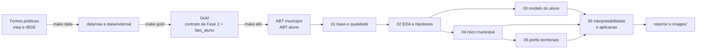

# Metodologia

Este documento descreve como o projeto foi conduzido, do dado bruto ao modelo interpretado, e por quê. O detalhe de cada decisão, com a evidência, está em [decisoes_analiticas.md](decisoes_analiticas.md); as fontes, em [fontes_de_dados.md](fontes_de_dados.md); as tabelas, em [dicionario_de_dados.md](dicionario_de_dados.md).

## 1. Fluxo geral

Cada etapa tem um notebook numerado e o código reutilizável fica em `src/`, organizado em `data`, `preprocessing`, `modeling`, `evaluation` e `visualization`. Os notebooks são executados de ponta a ponta (`make notebooks`) e os testes cobrem parsers, montagem das bases, pipeline e métricas (`make test`).

## 2. Dados

A Gold da Fase 2 foi recomposta com dado real, no mesmo contrato de esquema, a partir das planilhas de resultados e metas do Inep (2023 a 2025) e dos microdados por aluno (2024 e 2025). O enriquecimento vem do próprio Inep (INSE, Censo Escolar, rendimento, IDEB) e do IBGE (Censo 2022, PIB municipal, malha). Nenhuma fonte exige credencial.

Duas bases analíticas saem da Gold:

- **ABT de município**: uma linha por município e ano-alvo (2024, 2025 e 2026), com o histórico do indicador, a meta do ano e os blocos de contexto;
- **ABT de aluno**: uma linha por aluno avaliado (presente com prova preenchida), com rede, escola (tamanho e presença) e o contexto municipal do mesmo ano.

### Alinhamento temporal

Para o ano-alvo t (prova aplicada em outubro e novembro), só entram variáveis conhecidas antes: Censo Escolar de t (referência em maio), rendimento de t-1, IDEB até t-1, indicador de t-1, meta de t, e os estáticos (Censo 2022, PIB 2021, INSE 2023). A regra está em `src/data/abt.py` e é verificada em `tests/test_abt.py`. Para a projeção de 2026 valem as últimas edições publicadas, registradas em colunas `ref_*`.

## 3. Análise exploratória

A EDA (notebook 02) segue o formato hipótese, teste, decisão. Catorze hipóteses foram testadas com Kruskal-Wallis e eta quadrado (efeito da UF e da região), correlação de Spearman (contexto socioeconômico, condições de ensino, histórico), qui-quadrado (rede) e decomposição de variância (município, escola, aluno). Cada resultado gerou uma decisão de modelagem registrada em `docs/decisoes_analiticas.md`.

## 4. Pipeline de preprocessamento

Um único `ColumnTransformer`, dentro de um `Pipeline` do scikit-learn, com quatro ramos:

| Ramo | Colunas | Transformações |
|---|---|---|
| histórico | indicador, participação e salto necessário do ano anterior | mediana + indicador de ausência + escalonamento |
| log | população, área, densidade, PIB per capita, alunos com INSE, alunos avaliados na escola | mediana + log1p + escalonamento |
| numéricas | Censo Escolar, rendimento, IDEB, socioeconômico, presença na escola | mediana + escalonamento |
| categóricas | UF, rede | one-hot com categorias desconhecidas ignoradas |

O pipeline é ajustado dentro de cada fold da validação e é o objeto persistido em `models/`. Nada é ajustado antes do split, o que elimina o vazamento de estatísticas do teste para o treino.

## 5. Modelagem

### Modelo do aluno (notebook 03)

- Alvo: `alfabetizado` (proficiência >= 743). Universo: presentes com prova preenchida.
- Treino: 2024 (1,85 milhão de alunos), com pesos amostrais do Inep. Teste: 2025, aberto uma vez.
- Validação: `StratifiedGroupKFold` por município. Busca aleatória de hiperparâmetros em amostra estratificada de 300 mil alunos para regressão logística, Random Forest e LightGBM.
- Diagnóstico: gap treino-validação, ablação por bloco de variáveis e curva de aprendizado.
- Ponto de operação: limiar escolhido para recall mínimo de 70% da classe "não alfabetizado" nas probabilidades fora da amostra de 2024.

### Modelo de risco municipal (notebook 04)

- Alvo operacional: risco de não atingir a meta do ano. Alvo modelado: o nível do indicador (regressão), com o risco derivado por `P(resíduo < meta − nível previsto)` a partir da distribuição empírica dos resíduos da validação.
- Motivo: a regra das metas mudou entre 2024 e 2025 (em 2024 a meta acompanhava o resultado de 2023; em 2025 exige saltos). O classificador direto do alvo binário aprende a regra de 2024 e cai de 0,81 para 0,60 de AUC no teste temporal (0,75 na logística); a regressão do nível com a meta aplicada depois mantém o AUC do risco em torno de 0,77.
- Validação: `GroupKFold` por município; busca aleatória para Ridge, Random Forest e LightGBM; backtest 2024 para 2025; modelo final reajustado nas linhas de 2025 (retrato mais recente) para a projeção de 2026.

### Perfis territoriais (notebook 05)

K-Means sobre 15 variáveis de contexto padronizadas, K escolhido por cotovelo, silhueta e Davies-Bouldin, contraste com agrupamento hierárquico de Ward e PCA para interpretação. Os perfis são cruzados com o risco de 2026.

## 6. Avaliação

| Modelo | Métrica principal | Métricas de apoio | Métrica de operação |
|---|---|---|---|
| aluno | AUC-ROC ponderado | AUC-PR, acurácia, precisão, recall, F1, matriz de confusão, previsto x real por decil, AUC por UF | recall da classe "não alfabetizado" |
| município (nível) | MAE fora da amostra | RMSE, R², Spearman, viés, resíduo por UF | |
| município (risco) | AUC do risco no backtest | matriz de confusão no limiar de operação | recall da classe "não atingiu" |
| perfis | silhueta | Davies-Bouldin, índice de Rand ajustado (K-Means x Ward) | |

Em todos os casos as métricas são reportadas para treino e validação (para ler overfitting) e para o teste temporal (para ler generalização no tempo).

## 7. Interpretabilidade

SHAP (TreeExplainer) sobre o pipeline completo, no espaço transformado, com rótulos de negócio. Importância global (média do valor absoluto), importância por bloco de variáveis, dependência para as variáveis de contexto mais fortes, explicações locais em cascata para municípios específicos e importância por permutação como segunda opinião. Tudo no notebook 06, com as tabelas em `reports/`.

## 8. O que está fora do escopo e por quê

- **Séries temporais clássicas (ARIMA, SARIMA, Holt-Winters)**: o indicador tem três pontos por município (2023 a 2025), insuficiente para identificar e validar um modelo de série. O que a disciplina ensina entra como engenharia de atributos temporal (defasagens, variação, tendência do IDEB de 2005 a 2025) e como validação temporal walk-forward.
- **Inferência causal**: o projeto é preditivo. As relações encontradas (fluxo escolar, formação docente) são associações; estimar o efeito de uma intervenção exigiria um desenho causal, listado nas evoluções futuras.
- **Aprendizado por reforço**: não se aplica ao problema; a alocação sequencial de recursos entre municípios ao longo dos anos é uma extensão possível, também listada nas evoluções futuras.
